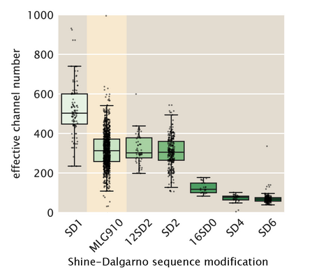

# YEAR-MONTH-DATE Experiment 1

## Purpose
Include a one-sentence explanation of why this experiment was performed. This
could be as simple as "This experiment serves as a biological replicate of a
kinesin-microtubule gliding assay."

## Materials
Set up a short table that includes vital information about the materials used. For biological experiments, this can include organism used and any genotypic information. For chemistry experiments, this could include reagents, amounts, molecular weights, and CAS numbers.

| **Organism** | **Parental Cross** | **Shorthand** | **Location** |
| :--: | :--: |:--:| :--:|
| *Drosophila melanogaster*| ♂*w*;;bcd/bcd x ♀ ;;+/+ | *bcd/+* | `Flat 4 vial 10`|

## Notes and Observations
* Did anything go awry? Did you notice a particular vial was mixed up or accidentally thrown away? Did you run at a different voltage than previous runs? Anything that occurs during your experiment that differs from the canonical protocol written down in the `miscellaneous/protcols` directory should be clearly and succinctly annotated here. 

## Summary of Results
Briefly summarize the results of the experiment and report data validation outcomes here (if possible). For example,  in order to verify that an experiment didn't have any pathological results you could generate a specific plot. You can then include that plot in this section along with some comments. For example,

Highlighted distribution shows oversampling relative to other samples.

## Experimental Protocol
What protocol did you follow? Write it down here in simple, easy to follow, and detailed steps. This will likely be identical to many other experimental runs, especially if you repeat the experiment. However, it should be modified wherever needed to ensure it represents the actual procedure follow. For example,

1. A strip of double-sticky tape was mounted on a glass slide.
2. Sample (listed in materials above) was harvested from crossing vials at 09h28m by flushing with CO_2_ and swiping with a wet paintbrush.
2. Embryos were dechorionated with 50% bleach for 20 - 30 seconds before being thoroughly washed with water. 
3. A strip of apple juice agarose was cut and mounted on a stereo microscope. Between 5 and 10 embryos were picked and mounted down the centerline of the agarose.
4. The embryos were transferred to the tape by gently pressing the tape-covered slide against the agarose pad. 
5. Two more strips of tape were mounted on either side of the embryos to create a channel approximately 5mm wide and two layers deep.
6. 20µL of halocarbon oil was transferred to the channel followed by a cover slip. 
7. Embryos were mounted on an inverted microscope. Between 5 and 10 positions were marked and a time lapse was acquired with the following parameters.
    * Channel: Brightfield
    * Exposure: 200ms
    * Autofocus settings: 10µm range, 1µm step, 10 slices
    * Time interval: 30 sec
    * Number of frame: 50
8. After the time lapse had completed, embryos were thrown in biological waste and data was transferred to the backup server. 